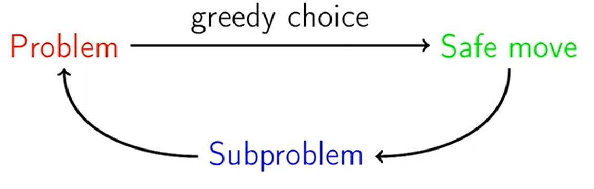

# Greedy Strategy 

1. Analyze the problem and make a greedy choice
2. Prove that it is a safe move
3. Reduce to a subproblem
4. Solve the subproblem

    

### Reduction to Subproblem
1. Make a first move
2. Then solve a smaller problem of the same kind

### Safe Move
A greedy choice is called safe move if there is an optimal solution consistent with this first move. 
- Not all first moves are safe
- Often greedy moves are not safe

## Examples 
- Largest number by concatenating the given numbers  
    Greedy algorithm: 
    1. Find max number
    2. Remove it
    3. Append to number
    4. Repeat until there are no more numbers left on the list
- Car fueling  
    Greedy Algorithm: 
    1. Start at A
    2. Refill at the farthest reachable gas station G 
    3. Make G the new A
    4. Get from new A to B with minimum number of refills

